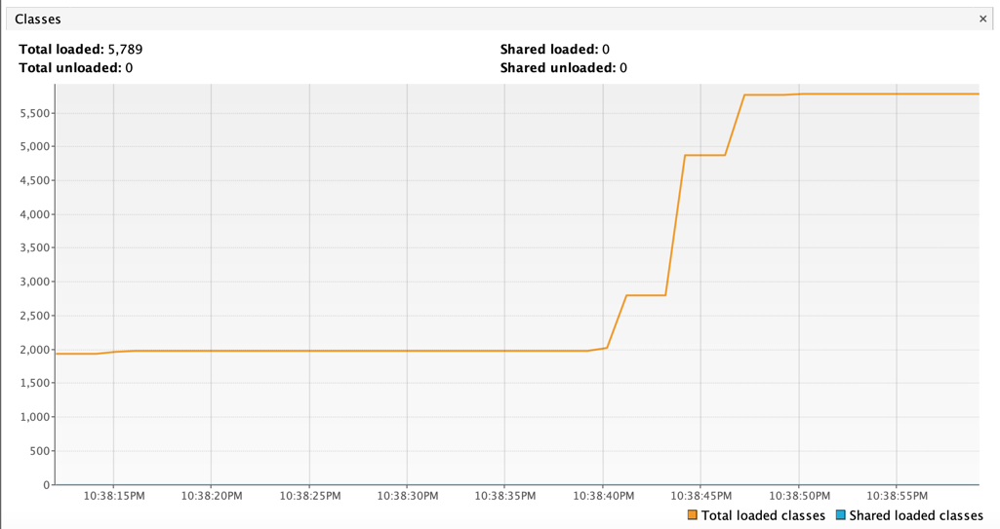

2 графика ниже соответствуют созданию 529, 2117 и 869 классов в metaspace.

График ниже отражает изменение максимального размера кучи, а далее ее рост
за счет 3-х кратного создания объектов в количестве 5000000
